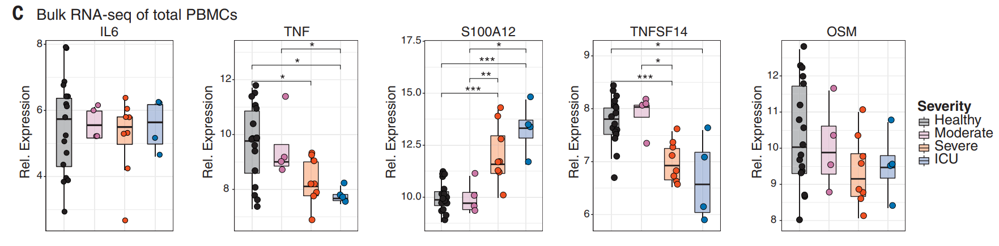

Code based on Ruth Isserlin's BCB420 course _Computational Systems Biology_, University of Toronto, Winter 2021.

# Introduction

We perform differential expression using edgeR and enrichment analysis using edgeR [@edgeR] on the bulk RNA-Seq dataset from [@arunachalam2020systems]. The dataset was obtained from GEO [@GEO] with id GSE152418. The provided data has 60683 rows corresponding to gene counts for 17 healthy and 17 COVID patients. After filtering out count per million below one per sample, we are left with 13973 genes. The data was normalized with edgeR's Trimmed Mean of M-values (TMM) method which has good empirical performance compared to other methods according to [@evans_normalizing]. After mapping from ensembl to HGNC identifiers using Biomart [@biomart], duplicate rRNA genes were removed and one observation of the other duplicate genes were kept. Genes that mapped to more than one HGCN symbol were also removed ([@arunachalam2020systems] did the same).

```{r message=FALSE}
if (!requireNamespace("BiocManager", quietly = TRUE))
 install.packages("BiocManager")
if (!requireNamespace("GEOmetadb", quietly = TRUE))
 BiocManager::install("GEOmetadb")

# exclusively using this library, so just use library(.)
library(GEOmetadb)
library(knitr)
library(edgeR)
library(biomaRt)
```

Get the filtered and normalized data saved as covid_data.rds


```{r message=FALSE}
covid_data <- readRDS("covid_data.rds")
```


```{r message=FALSE}
kable(covid_data[1:5,1:5], type="html")

```

# Differential Expression

## Heatmap
```{r message=FALSE}
heatmap_matrix <- covid_data[,
 3:ncol(covid_data)]
rownames(heatmap_matrix) <- rownames(covid_data)

mygroups <- c()
for (i in 1:17){
  mygroups <- c(mygroups, sprintf("%s_covid", i))
}
for (i in 1:17){
  mygroups <- c(mygroups, sprintf("%s_healthy", i))
}

# group information obtained from the "Characteristics" of each sample on GEO

ha_groups = c("Moderate", "Moderate", "Severe", "Severe",
              "ICU", "Severe", "Moderate", "Severe", "ICU",
              "Severe", "Moderate", "ICU", "Severe", "ICU",
              "Severe", "Severe", "Moderate", "Healthy",
              "Healthy","Healthy","Healthy","Healthy",
              "Healthy","Healthy","Healthy","Healthy",
              "Healthy","Healthy","Healthy","Healthy",
              "Healthy","Healthy","Healthy","Healthy")
colnames(heatmap_matrix) <- ha_groups

```


```{r message=FALSE}
library(ComplexHeatmap)
library(circlize)

#                 Moderate,  Severe,   ICU,     Healthy

ha_colours <- c("rosybrown1","red","darkred", "palegreen1")
names(ha_colours) <- unique(ha_groups)

ha <- HeatmapAnnotation(df=data.frame(
                         type = ha_groups),
                         col = list(type = ha_colours))


heatmap_matrix <- t(scale(t(heatmap_matrix)))
if(min(heatmap_matrix) == 0){
 heatmap_col = colorRamp2(c( 0, max(heatmap_matrix)), 
 c( "white", "red"))
 } else {
 heatmap_col = colorRamp2(c(min(heatmap_matrix), 0,
 max(heatmap_matrix)), c("blue", "white", "red"))
 }

covid_heatmap <- Heatmap(as.matrix(heatmap_matrix),
         cluster_rows = TRUE, show_row_dend = TRUE,
         cluster_columns = TRUE,show_column_dend = FALSE,
         col=heatmap_col,show_column_names = FALSE, 
         show_row_names = FALSE,show_heatmap_legend = TRUE,
         top_annotation = ha)


```
```{r message=FALSE}
covid_heatmap
```


## edgeR

```{r message=FALSE}
expressionMatrix <- as.matrix(covid_data[,3:36])
rownames(expressionMatrix) <- 
 covid_data$ensembl_gene_id
colnames(expressionMatrix) <- 
 colnames(covid_data)[3:36]

```

Define contrast/comparison groups

```{r message=FALSE}
samples <- data.frame(lapply(mygroups,
                               FUN=function(x){unlist(strsplit(x, split = "_"))[c(1,2)]}))
  colnames(samples) <- colnames(covid_data)[3:36]
  rownames(samples) <- c("patients","cell_type")
  samples <- data.frame(t(samples))
  
samples[1:5,]

```

```{r message=FALSE}
model_design <- model.matrix(~ samples$cell_type )
kable(model_design, type="html")

```

Run differential expression

```{r message=FALSE}
d = DGEList(counts=expressionMatrix, group=samples$cell_type)
d <- estimateDisp(d, model_design)
fit <- glmQLFit(d, model_design)

```

Choose the more stringent bonferroni method for adjusted p-values because BH produced over 25% DE genes (advice from [@geistlinger2021toward]).

```{r message=FALSE}
qlf.pos_vs_neg <- glmQLFTest(fit, coef='samples$cell_typehealthy')

kable(topTags(qlf.pos_vs_neg, adjust.method = "bonferroni"), type="html",row.names = FALSE,digits = 32)

```

```{r message=FALSE}
qlf_output_hits <- topTags(qlf.pos_vs_neg,adjust.method = "bonferroni",  sort.by = "PValue",
 n = nrow(covid_data))

```

```{r message=FALSE}
length(which(qlf_output_hits$table$PValue < 0.05))
print("Percentage of all genes: ")
print(length(which(qlf_output_hits$table$PValue < 0.05)) / dim(qlf_output_hits)[1])
```

```{r message=FALSE}
length(which(qlf_output_hits$table$FWER < 0.05))
print("Percentage of all genes: ")
print(length(which(qlf_output_hits$table$FWER < 0.05)) / dim(qlf_output_hits)[1])
```

Upregulated genes
```{r message=FALSE}
length(which(qlf_output_hits$table$FWER < 0.05
 & qlf_output_hits$table$logFC > 0))

```

Downregulated genes
```{r message=FALSE}
length(which(qlf_output_hits$table$FWER < 0.05
 & qlf_output_hits$table$logFC < 0))
```

Write out gene names
```{r message=FALSE}
qlf_output_hits_withgn <- merge(covid_data[,1:2],qlf_output_hits, by.x=1, by.y = 0)

qlf_output_hits_withgn[,"rank"] <- -log(qlf_output_hits_withgn$FWER, base = 10) * sign(qlf_output_hits_withgn$logFC)
                                        
qlf_output_hits_withgn <- qlf_output_hits_withgn[order(qlf_output_hits_withgn$rank),]

upregulated_genes <- qlf_output_hits_withgn$hgnc_symbol[
 which(qlf_output_hits_withgn$FWER < 0.05
 & qlf_output_hits_withgn$logFC > 0)]
downregulated_genes <- qlf_output_hits_withgn$hgnc_symbol[
 which(qlf_output_hits_withgn$FWER < 0.05
 & qlf_output_hits_withgn$logFC < 0)]

write.table(x=upregulated_genes,
 file=file.path("covid_upreg_genes.txt"),sep = '\t',
 row.names = FALSE,col.names = FALSE,quote = FALSE)

write.table(x=downregulated_genes,
 file=file.path("covid_downreg_genes.txt"),sep = '\t',
 row.names = FALSE,col.names = FALSE,quote = FALSE)

write.table(x=data.frame(genename= qlf_output_hits_withgn$hgnc_symbol, F_stat=qlf_output_hits_withgn$rank),
 file=file.path("covid_ranked_genes.txt"),sep = '\t',
 row.names = FALSE,col.names = FALSE,quote = FALSE)


```

## Volcano Plot

Look at the genes of interest identified in the paper and see where they are in the volcano plot.
```{r message=FALSE}
idx <- qlf_output_hits_withgn$hgnc_symbol %in% c("IL6", "TNF", "S100A12", "TNFSF14", "OSM")
genes_of_interest <- qlf_output_hits_withgn[idx,]
genes_of_interest
```

```{r message=FALSE}
all_genes <- cbind(qlf_output_hits_withgn$logFC, -log(qlf_output_hits_withgn$FWER, base = 10))
sig_idx <- qlf_output_hits_withgn$FWER < 0.05
sig_genes <- all_genes[sig_idx, ]
int_genes <- cbind(genes_of_interest$logFC, -log(genes_of_interest$FWER, base=10))

plot(all_genes, pch=16, ylab = "log10(adjusted P-value)", xlab = "logFC")
title("Volcano Plot of Filtered GSE152418 Data")
points(sig_genes, pch=16, col="red")
points(int_genes, pch=16, col="purple")
legend(-8,10, legend=c("Genes", "Signif. Genes", "Genes of interest"),
       col=c("black", "red", "purple"), bty="o",pch=c(16,16,16), cex=0.6)
```

Looks like only one gene of interest, as identified by [@arunachalam2020systems], was considered significantly differentially expressed. Is this a contradiction to the results in the paper? From [@arunachalam2020systems], these genes of interest are most significantly DE between healthy vs. severe/ICU COVID patients (Figure 5C shown below).



COVID patients with moderate symptoms had expression for these genes similar to that of healthy patients. They did not do DE between healthy vs. all COVID patients with their bulk RNA Seq data.


# Answers to Questions

## DE

1. Calculate p-values for each of the genes in your expression set. How many genes were significantly differentially expressed? What thresholds did you use and why?

Using edgeR, 6143 genes were significantly differentially expressed, i.e. 46.8% of all given genes. Just used the default $p < 0.05$ because we are using the adjusted p-value anyway for ORA, the cutoff would matter there.

2. Multiple hypothesis testing - correct your p-values using a multiple hypothesis correction method. Which method did you use? And Why? How many genes passed correction?

Used the bonferroni method for correcting p-values. This is the more stringent method and was recommended by [@geistlinger2021toward] if using Benjamini-Hochberg gave over 25% DE genes, which was the case here. The final percentage of DE genes is also above 1%, which was the suggested lower bound in [@geistlinger2021toward]. 

3. Show the amount of differentially expressed genes using an MA Plot or a Volcano plot. Highlight genes of interest.

Plot shown above.

4. Visualize your top hits using a heatmap. Do you conditions cluster together? Explain why or why not.

Comparing all groups (healthy, moderate, severe, ICU) shows a nice clustering between healthy vs. COVID patients, but no clustering between the different levels of severity. This is consistent with Figure 4.H of [@arunachalam2020systems] where the severity variable does not explain the variance of gene expression levels well.


## Thresholded ORA

1. Which method did you choose and why?

We use [@gprofiler]'s g:profiler web interface for thresholded ORA. As discussed in lecture, thresholded ORA is simple and gives a general idea of what pathways may be involved. Also, gprofiler is updated regularly, concurrently with the update schedule of its data sources according to the [FAQ page](https://biit.cs.ut.ee/gprofiler/page/faq).

2. What annotation data did you use and why? What version of the annotation are you using?

Use the GO biological processes annotation data because they are comprehensive and frequently updated. Did not choose GO molecular function because the results are not as interpretable. GO Biological processes is the 2020-12-08 release [@gene_ontology_old, @gene2021gene]. Reactome is the 2020-12-15 release [@jassal2020reactome].

3. How many genesets were returned with what thresholds?

Using a FDR threshold of < 0.05, 164 (GO-BP) and 13 (Reactome) were returned for upregulated genes, 279 (GO-BP) and 226 (Reactome) were returned for downregulated genes, and 474 (GO-BP) and 174 (Reactome) were returned when using both lists together. Because of the order of the columns, the up/downregulation is in healthy cells, so reverse the up/down for COVID cells, e.g. the downregulated list (upregulated in COVID) contains many immune response pathways.

4. Run the analysis using the up-regulated set of genes, and the down-regulated set of genes separately. How do these results compare to using the whole list (i.e all differentially expressed genes together vs. the up-regulated and down regulated differentially expressed genes separately)?

Upreg: [link](https://biit.cs.ut.ee/gplink/l/9aaqChZmS-)
Downreg: [link](https://biit.cs.ut.ee/gplink/l/85tNMy2eTT)
All DE: [link](https://biit.cs.ut.ee/gplink/l/4JcTluWNRu)

Using the whole list does not give the union of the results obtained using the up/downregulated lists individually. Also since the corrected p-values of the downreg set is orders of magnitude less than those of the upreg set, using both lists just gives the significant pathways from the downreg set.

## Interpretation

1. Do the over-representation results support conclusions or mechanism discussed in the original paper?

In Figure 4C, [@arunachalam2020systems] found IFN signalling pathways to be over represented COVID patients from their CITE-Seq data. This was not found in the overrepresented GO biological processes. However other immune system related pathways were found, many relating to the Fc-gamma receptor signaling pathway.

2. Can you find evidence, i.e. publications, to support some of the results that you see. How does this evidence support your results.

The Fc-gamma receptor signaling pathway was found to help viral entry in [@bournazos2020role] as part of an interesting study on the cases when antibodies, instead of providing immunity, may help viral entry in cells.

# Session Info

```{r}
sessionInfo()
```


# References
