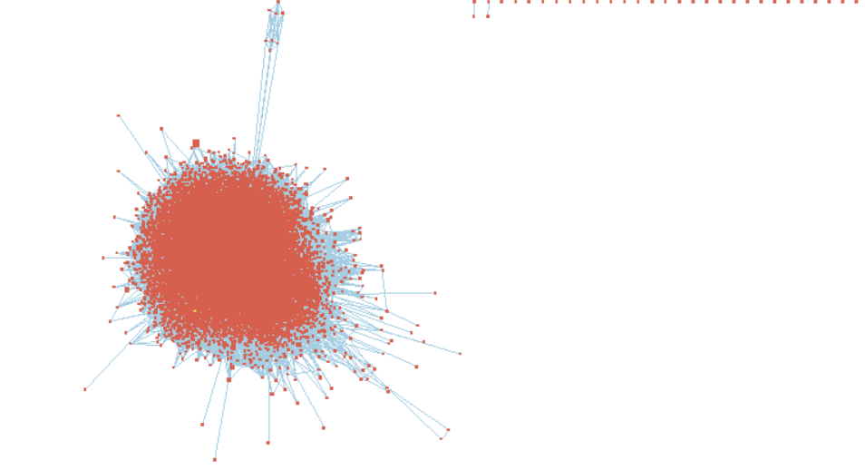

Code based on Ruth Isserlin's BCB420 course _Computational Systems Biology_, University of Toronto, Winter 2021.

# Introduction

Based on the series GSE152418 of 17 healthy vs. 17 COVID patient bulk RNA-Seq samples, a list of ranked genes by their log fold change was obtained after normalization by edgeR [@edgeR]. Previously, a thresholded gene set enrichment analysis using g:Profiler [@gprofiler] was performed. Here we compare the pathways found significant by g:Profiler with the results of a non-thresholded method GSEA.

# Non-thresholded GSEA

1. What method did you use? What genesets did you use? Make sure to specify versions and cite your methods.

We used GSEA [@gsea1, @gsea2] with the following parameters:
* Number of permutations: 1000
* Max size: 250
* Min size: 15
* Version: 4.1.0

We used the Human GO Biological Pathways geneset curated by Bader Lab on March 1, 2021, obtained [here](http://download.baderlab.org/EM_Genesets/March_01_2021/Human/symbol/) [@bader_genesets]. 

2. Summarize your enrichment results.

Ten times more genesets were significantly upregulated than downregulated in COVID samples (401/4996 vs. 43/4996). As expected, viral mRNA translation was upregulated in COVID samples. The immune system-related upregulated pathways in COVID samples include humoral immune response, adaptive immune response, immunoglobulin-mediated immune response. Pathways relevant to the [@arunachalam2020systems] paper were found to be significantly upregulated: hallmark interferon alpha response, defense response to bacterium, regulation of acute inflammatory response, and hallmark MTORC1 signalling. All pathways listed above have FDR < 0.01. 

3. How do these results compare to the results from the thresholded analysis in Assignment #2. Compare qualitatively. Is this a straight forward comparison? Why or why not?

In the thresholded analysis using g:Profiler, interferon alpha response was not found, where it was found to be significant in GSEA. This pathway was analyzed in the original [@arunachalam2020systems] paper for the data. The Fc-gamma receptor signalling pathway was significant in both g:Profiler and GSEA (FDR = 0.026). Both methods found immune response pathways to be upregulated in COVID samples. Qualitatively GSEA was able to find more genesets which [@arunachalam2020systems] found. This makes sense because they used non-thresholded instead of thresholded enrichment analysis [see code](https://github.com/scottmk777/COVID/blob/master/helper_setEnrichment.R). However the comparison is not straight-forward. Both tools are meant to provide an exploratory view of the data for further analysis, not to draw conclusions.

# Cytoscape Visualization

Create an enrichment map - how many nodes and how many edges in the resulting map? What thresholds were used to create this map? Make sure to record all thresholds. Include a screenshot of your network prior to manual layout.

18,727 nodes and 1,268,683 edges. The following thresholds were used:
* FDR q-value cutoff: 0.05
* p-value cutoff: 1.0
* Metric: Jaccard+Overlap cutoff at 0.5 for sparser graph

If using figures create a figures directory in your repo and make sure all references to the figures are relative in your Rmarkdown notebook.

# Interpretation

Do the enrichment results support conclusions or mechanism discussed in the original paper? How do these results differ from the results you got from Assignment #2 thresholded methods

Yes, the pathways found to be significant in [@arunachalam2020systems] were also found to be significant in non-thresholded GSEA. One difference is that Interferon-alpha production was found to be suppressed in [@arunachalam2020systems] but was found to be upregulated in GSEA. We will investigate this further in the next section.

## mTOR Pathway

Choose a specific pathway or theme to investigate in more detail. Why did you choose this pathway or theme? Show the pathway or theme as a gene network or as a pathway diagram. Annotate the network or pathway with your original log fold expression values and p-values to show how it is effected in your model. 

The [mTOR signaling pathway (WP1471)](https://www.wikipathways.org/index.php/Pathway:WP1471) was found by [@arunachalam2020systems] to be significantly downregulated in COVID samples. However, annotation of the WikiPathway using the log fold-change of the ranked gene list does not reproduce their observation. This pathway was not found to be significant in GSEA's results.

Interestingly mTOR is short for Mammalian target of Rapamycin, a drug that may be repurposed for treating COVID-19 symptoms [@husain2020rapamycin]. Rapamycin's action inhibits the mTOR signaling pathway, which would agree with the overexpression of some genes in COVID samples of the pathway shown in the figure above.

# References

